# MailHub-GoogleOauth
首选确定你的域名是什么？

比如是：https://mailhub.xxx.com 。下面的所有地址都会使用此域名

```
#谷歌项目ID
GOOGLE_CLOUD_PROJECT_ID=

#OAuth客户端ID
GOOGLE_CLIENT_ID=
#OAuth客户端密钥
GOOGLE_CLIENT_SECRET=
#OAuth客户端回调地址
GOOGLE_REDIRECT_URI=https://mailhub.xxxx.com/oauth/callback

#是否开通谷歌订阅推送
GOOGLE_GMAIL_WATCH_ENABLED=false
#Pub/Sub 主题名字
GOOGLE_GMAIL_PUBSUB_TOPIC=

#服务号电子邮件
GOOGLE_GMAIL_PUBSUB_SERVICE_ACCOUNT=
#订阅名称
GOOGLE_GMAIL_PUBSUB_SUBSCRIPTION=
#Pub/Sub 订阅推送地址
GOOGLE_GMAIL_PUBSUB_AUDIENCE=https://mailhub.xxxx.com/api/webhooks/google/gmail

GOOGLE_OAUTH_SCOPES=openid email profile https://www.googleapis.com/auth/gmail.readonly
GMAIL_API_BASE_URL=https://gmail.googleapis.com/gmail/v1
```

## 1、创建项目

应用创建入口：[https://console.cloud.google.com/](https://console.cloud.google.com/)

<figure class="image">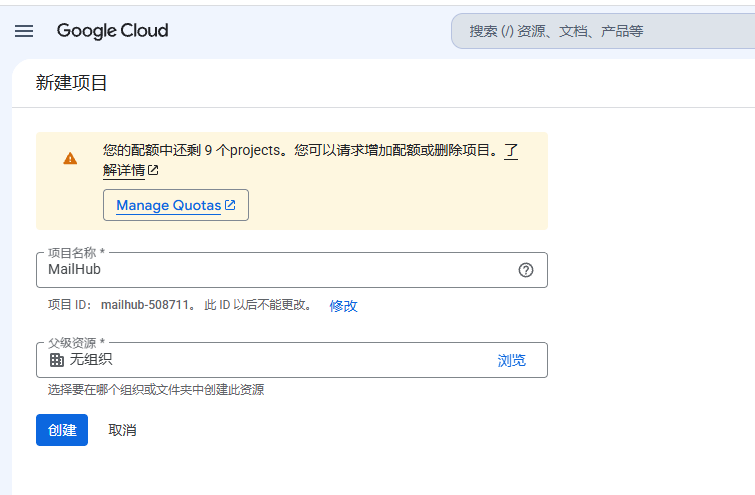</figure>

**这一步可以获得** `**GOOGLE_CLOUD_PROJECT_ID**` 

## 2、服务账号

顶部搜索“”服务账号”

<figure class="image">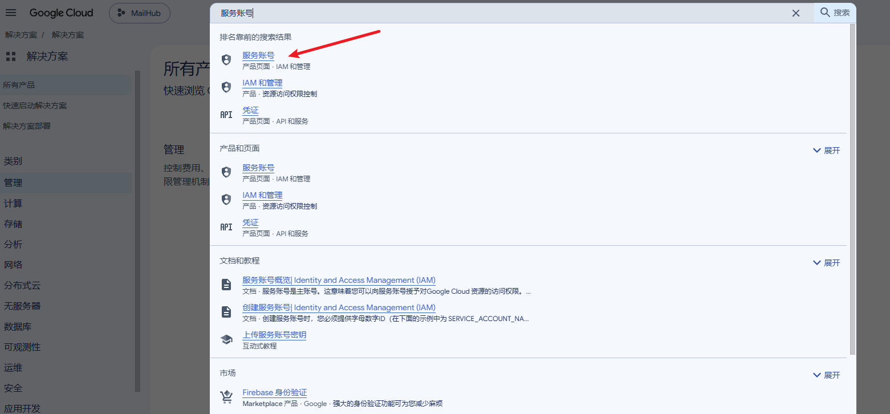</figure><figure class="image">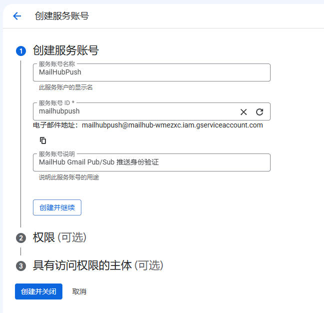</figure>

其他全部默认

<figure class="image">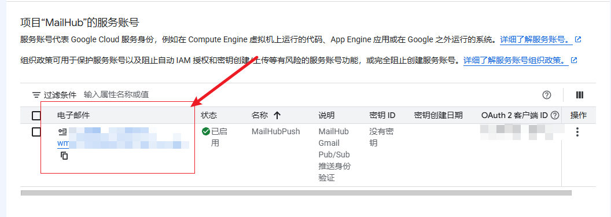</figure>

**这一步可以获取：**`**GOOGLE_GMAIL_PUBSUB_SERVICE_ACCOUNT**`

## 3、API 和服务

搜索：API 和服务

<figure class="image">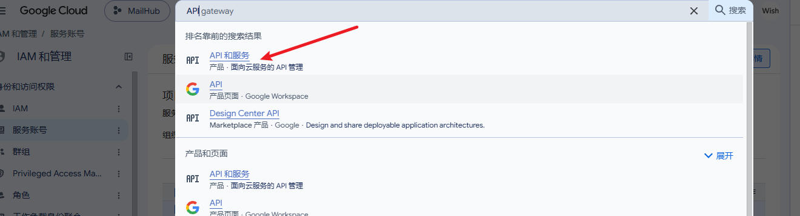</figure>

点击启动API和服务

<figure class="image">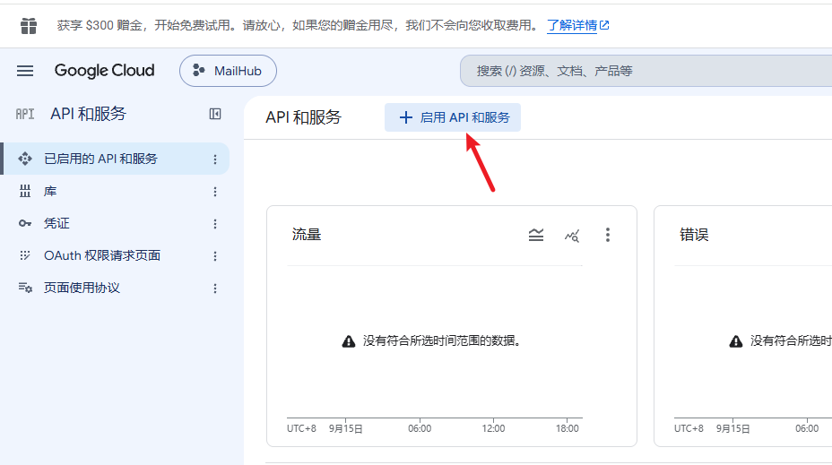</figure>

搜索启用 `Gmail API`和`Pub/Sub`

<figure class="image">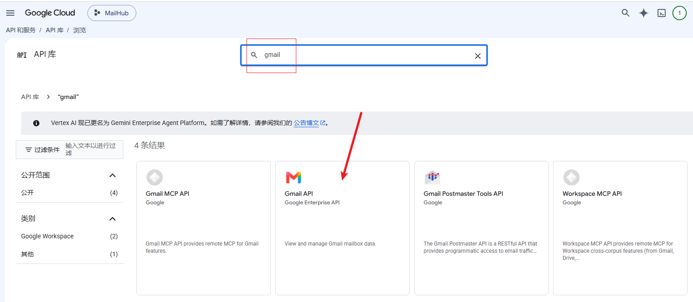</figure><figure class="image">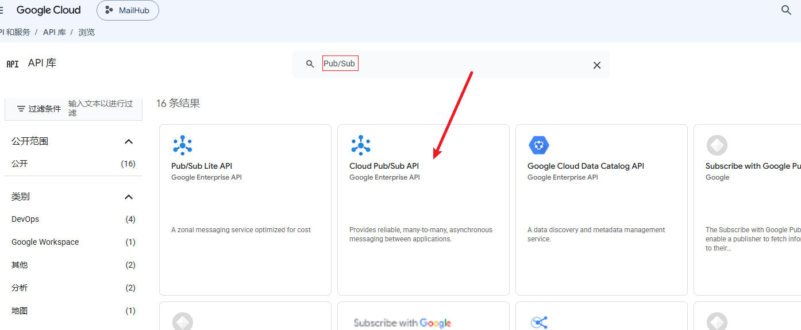</figure>

## 4、配置 oauth

<figure class="image">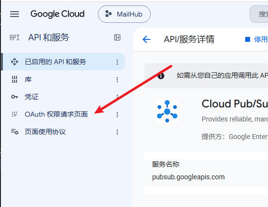</figure><figure class="image">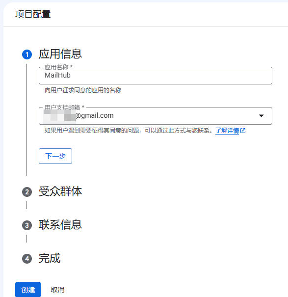</figure><figure class="image">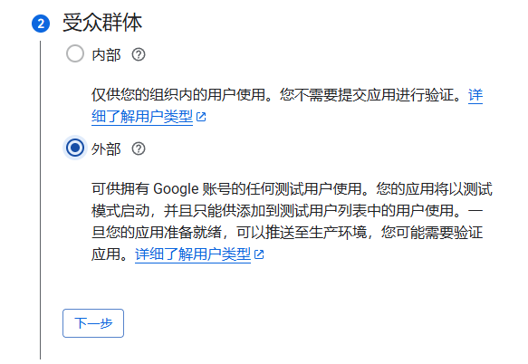</figure><figure class="image">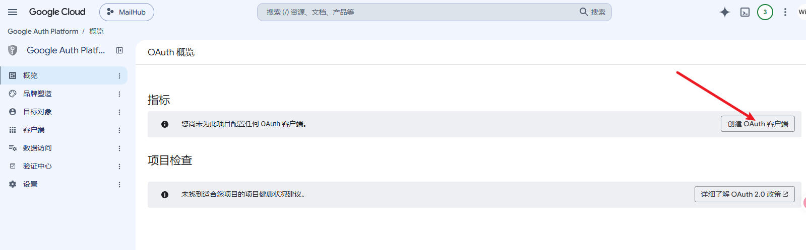</figure><figure class="image">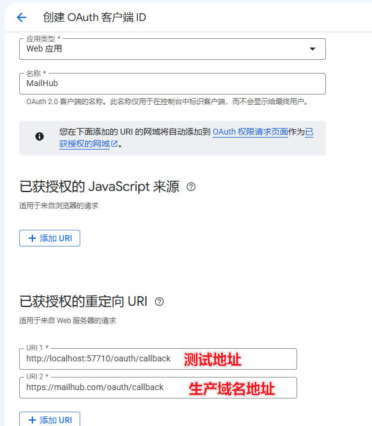</figure><figure class="image">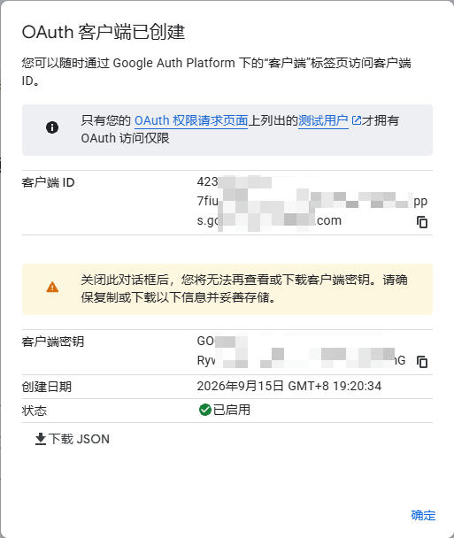</figure>

**这一步获取了：**`**GOOGLE_CLIENT_ID**`**,**`**GOOGLE_CLIENT_SECRET**`

## 5、配置应用信息

<figure class="image">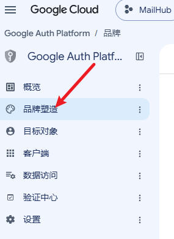</figure>

<figure class="image">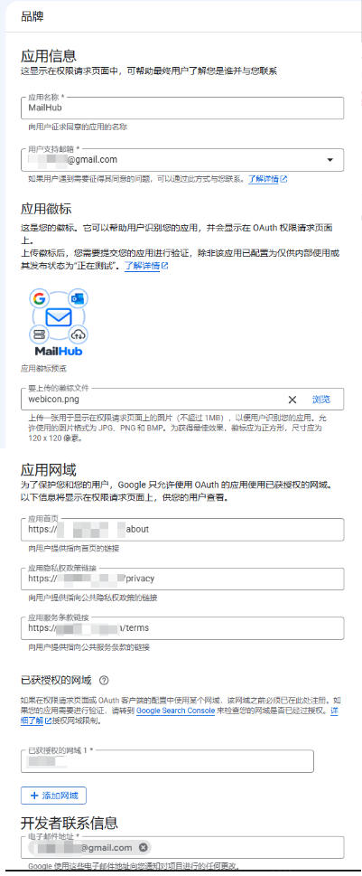</figure>

## 6、发布应用

<figure class="image">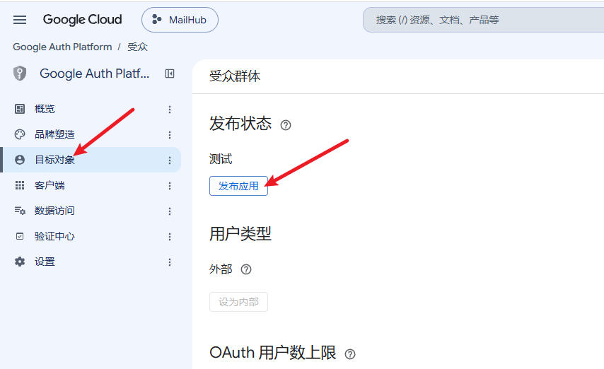</figure>

他会提示如下

<figure class="image">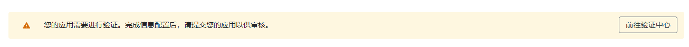</figure>

不用理会，自己使用不影响

## 7、配置 Pub/Sub

<figure class="image">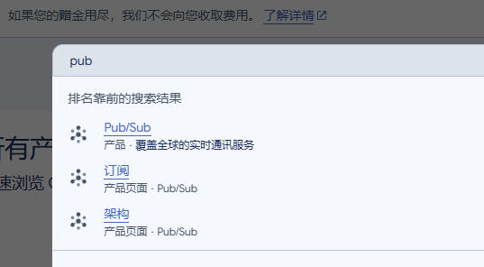</figure><figure class="image">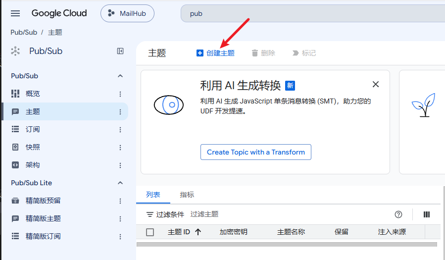</figure><figure class="image">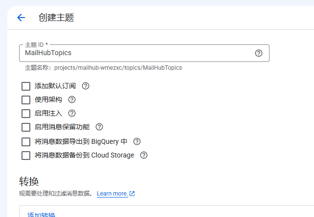</figure><figure class="image">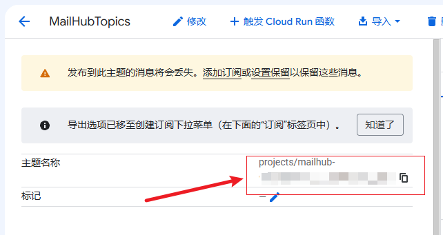</figure>

**这一步获取了：**`**GOOGLE_GMAIL_PUBSUB_TOPIC**`

### 配置权限

<figure class="image">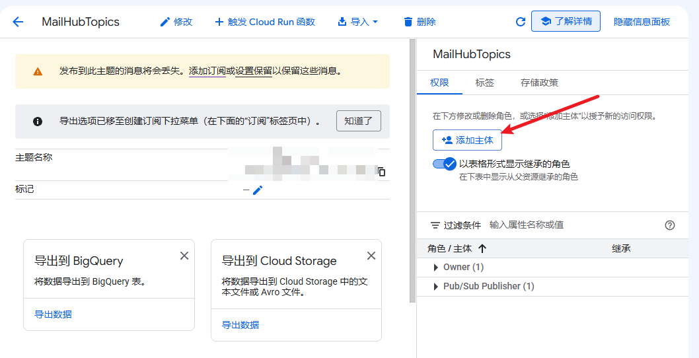</figure>

主体配置：`gmail-api-push@system.gserviceaccount.com`

如果提示没有，等一等刷新页面

<figure class="image">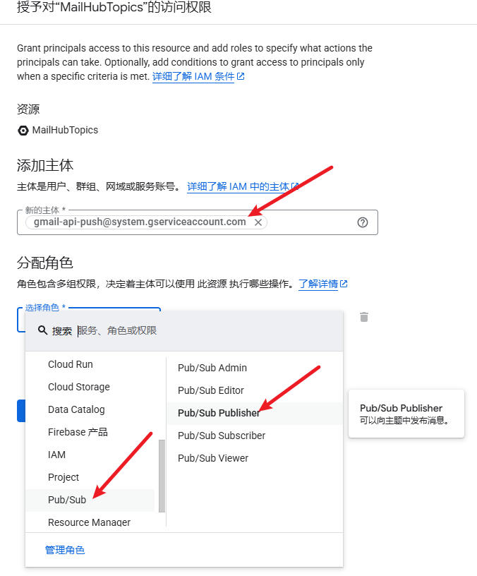</figure>

## 8、配置订阅

<figure class="image">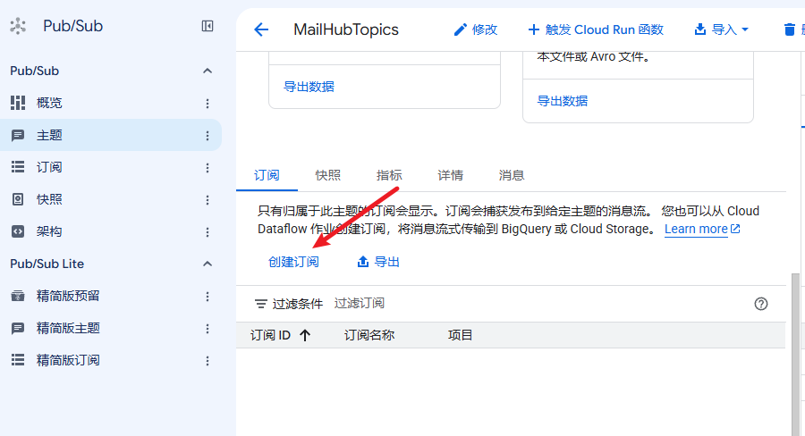</figure><figure class="image">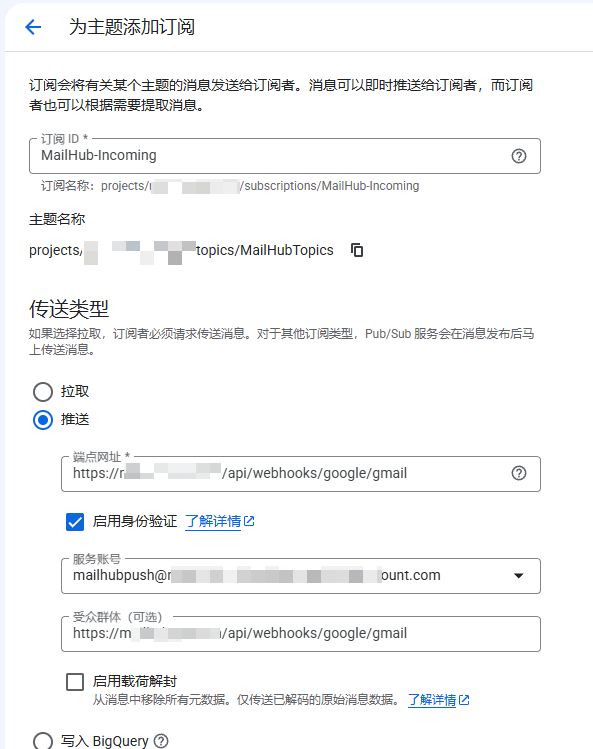</figure><figure class="image">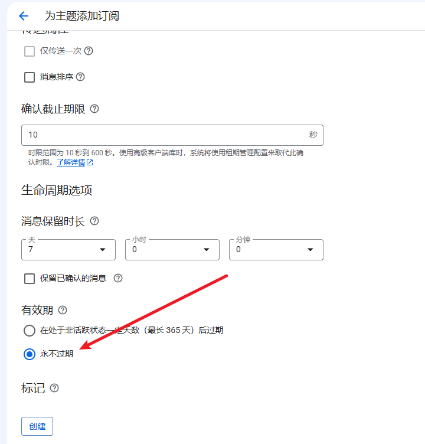</figure><figure class="image">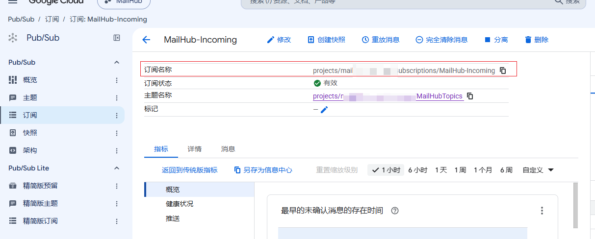</figure>

**这一步获取了：**`GOOGLE_GMAIL_PUBSUB_SUBSCRIPTION`

## 谷歌应用配置已完成！